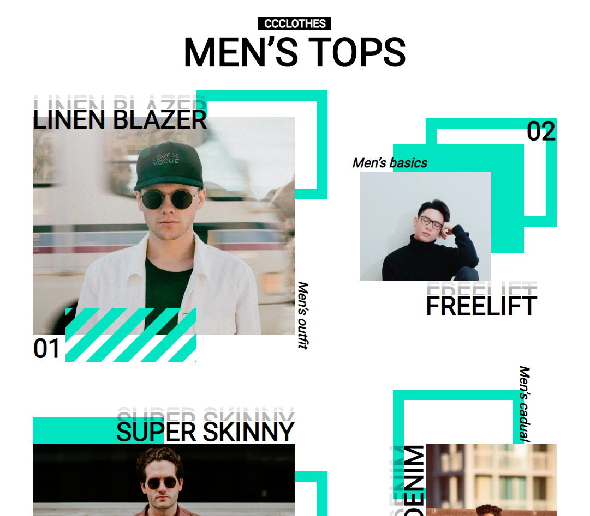

## 【練習作品】時尚服飾網站
***
### 練習主題：版型練習
### 技術：html + CSS
### 頁面展示：<https://zshao1031.github.io/TheF2E-Week-4/>
### 未實作功能：無

### 預覽圖片：

***
## 【其他說明】
### The F2E 活動：這是由《六角學院》所舉辦的練功活動，每週出一主題(附設計稿)給參加者練習，參與者可自行決定實作到什麼程度，但至少要挑一頁版型來製作。

### 設計稿：https://hexschool.github.io/THE_F2E_Design/week4-product%20gallery/?fbclid=IwAR0TGUuDIghbGlX-wNh1N1C7enCncgSg6xW2DU-fi7G9J52n-eQILd7rTW0
